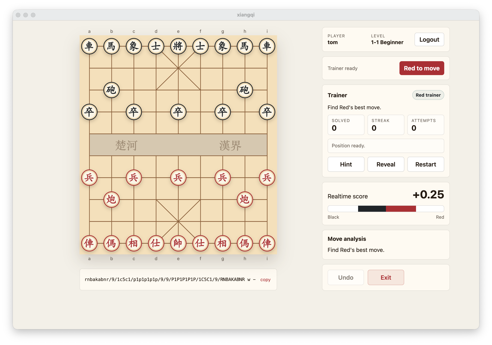

# xiangqi

xiangqi is a desktop Chinese chess app for playing, training, and reviewing games. It combines a clean board, local Pikafish engine analysis, online matches, player levels, and PGN tools in one app.



Use it when you want to:

- Play a full Xiangqi game against Pikafish, a local opponent, or another player online.
- Practice with Trainer mode: find the best move, ask for a hint, reveal the answer, restart the position, and track solved positions, attempts, and streaks.
- Study positions with realtime evaluation, best-move suggestions, move-quality feedback, and a visual score bar.
- Sign in for online play, ranked/random matchmaking, room-code matches, and persistent levels from `1-1` to `10-10`.
- Import and replay PGN games, export your own games, or copy the current FEN for sharing.
- Run engine analysis locally through bundled Pikafish and NNUE files.

## Main Functions

- **Play**: choose AI games, local human vs human, online human vs human, ranked/random matchmaking, or room-code matches.
- **Train**: solve best-move challenges with Hint, Reveal, Restart, solved count, streak, and attempt tracking.
- **Analyze**: see live score, recommended moves, and move-quality feedback while you play.
- **Review**: import PGN, step through saved games, and export finished games.
- **Account and levels**: log in or sign up for online play; ranked results update persistent level points.

## Project Structure

```text
src/
  main/
    main.cts         # TypeScript Electron main process source
    preload.cts      # TypeScript Electron preload source
  renderer/
    index.html
    app.ts           # TypeScript renderer source
    styles.css
dist/                # generated JavaScript output, ignored by git
tsconfig.json
../xiangqiserver/
  server.js          # standalone auth/match relay server
```

The client app runs in Electron. Renderer, main process, preload, and packaging hook code are authored in TypeScript and compiled to ignored `dist/` output before app startup/build. The server lives next to this repository in `../xiangqiserver` and is a lightweight Node HTTP service for auth, levels, presence, and online match relay.

## Requirements

- Node.js 20+ recommended for the app/server.
- npm.
- Pikafish executable(s) and an NNUE file for AI analysis.
- Electron dependencies installed with `npm install`.

## Install

```sh
npm install
```

## Engine Files

The Electron client uses `pikafish.nnue` plus either a single override engine or a bundled engine directory. For bundled releases, put all platform-compatible engines in `pikafish-engines/`; the app tries them from strongest to weakest on the user's computer and keeps the first one that starts.

```text
pikafish-engines/
  pikafish-avx2
  pikafish-sse41-popcnt
pikafish.nnue
```

For local development, the old root-level `pikafish` or `pikafish.exe` fallback still works.

You can override the paths:

```sh
PIKAFISH_PATH=/path/to/pikafish PIKAFISH_NNUE=/path/to/pikafish.nnue npm start
```

## Run Locally

Start the match/auth server:

```sh
npm run server
```

Start the Electron client:

```sh
npm start
```

`npm start` compiles the TypeScript sources first, then opens Electron.

By default the Electron app points to:

```text
https://xiangqi.abecomputers.ca
```

Use a different server URL when needed:

```sh
XIANGQI_SERVER_URL=http://localhost:4173 npm start
```

For LAN testing:

```sh
HOST=0.0.0.0 PORT=4173 npm run server
XIANGQI_SERVER_URL=http://YOUR_COMPUTER_IP:4173 npm start
```

## Build macOS Client

The macOS package bundles:

- `pikafish-engines/`
- `pikafish.nnue`

Build unsigned macOS DMG and ZIP artifacts:

```sh
npm run dist:mac
npm run dist:mac:arm64
```

The output is written to `dist/`. Because the app is unsigned and not notarized, macOS may require right-clicking the app and choosing Open the first time.

## Build Windows Client

Windows builds bundle all Windows Pikafish executables from the official release archive. The app chooses the strongest binary that starts successfully on the user's CPU.

Required files:

```text
pikafish-engines/*.exe        # Windows executables
pikafish.nnue                 # copied from the official Pikafish release archive
```

Build unsigned Windows NSIS and ZIP artifacts:

```sh
npm run dist:win
```

## Build Linux Client

Linux builds bundle all Linux Pikafish executables from the official release archive. The app chooses the strongest binary that starts successfully on the user's CPU.

Required files:

```text
pikafish-engines/pikafish*    # Linux ELF executables, chmod +x
pikafish.nnue                 # copied from the official Pikafish release archive
```

For local packaging, download the official Pikafish archive and copy all Linux binaries plus the included NNUE file:

```sh
curl -fL https://github.com/official-pikafish/Pikafish/releases/download/Pikafish-2026-01-02/Pikafish.2026-01-02.7z -o pikafish.7z
7z x pikafish.7z -opikafish-release -y
rm -rf pikafish-engines
mkdir -p pikafish-engines
find pikafish-release/Linux -maxdepth 1 -type f -name 'pikafish*' -exec install -m 755 {} pikafish-engines/ \;
nnue_path="$(find pikafish-release -type f -name pikafish.nnue -print -quit)"
install -m 644 "$nnue_path" ./pikafish.nnue
file pikafish-engines/*       # should include "ELF"
```

Then build Linux AppImage, DEB, and tar.gz artifacts:

```sh
npm ci
npm run dist:linux
```

## Automated GitHub Releases

The repository includes `.github/workflows/release.yml` for automatic Windows, Linux, and macOS ARM64 releases. It runs automatically when a tag matching `v*` is pushed, and can also be started manually from the Actions tab with:

- release tag
- optional Pikafish release archive URL
- whether to upload to the GitHub release

Build runners:

- Linux: `ubuntu-latest`
- Windows: `windows-latest`
- macOS ARM64: `[self-hosted, macOS, ARM64]`

The macOS ARM64 runner must have `7zz` or `7z` available. If neither exists, the workflow installs `p7zip` with Homebrew.

The workflow downloads `Pikafish.2026-01-02.7z` from the official `official-pikafish/Pikafish` release by default, bundles all engines for each target OS, copies the included `pikafish.nnue`, validates the engine files, packages Electron, uploads workflow artifacts, and publishes the files plus SHA-256 checksums to the GitHub release. Runtime CPU selection happens on the user's computer.

## Online Server

The server exposes:

- `POST /api/auth/signup`
- `POST /api/auth/login`
- `POST /api/auth/me`
- `POST /api/match/create`
- `POST /api/match/join`
- `POST /api/match/queue`
- `POST /api/match/ranked-queue`
- `GET /api/match/:code/events`
- `POST /api/match/:code/move`
- `POST /api/match/:code/resign`
- `POST /api/match/:code/rematch`
- `POST /api/match/:code/gameover`
- `POST /api/match/:code/leave`
- `POST /api/match/:code/state`

User data is stored as JSON by the server under:

```text
../xiangqiserver/data/users.json
```

Do not commit real production user data.

## PGN Replay

PGN mode reads user-provided game files directly. Users can drag a PGN file into the import panel or choose one with Open file. Single-game PGNs import automatically; `.pgns` and other multi-game PGN files show a selectable game list.

## Deployment

Deploy the `xiangqiserver` folder to your host. The server has no runtime dependencies beyond Node built-ins.

Example systemd environment:

```ini
[Service]
User=ubuntu
WorkingDirectory=/home/ubuntu/xiangqi-server
Environment=HOST=0.0.0.0
Environment=PORT=4173
ExecStart=/usr/bin/node /home/ubuntu/xiangqi-server/server.js
Restart=always
```

Open TCP port `4173` in both the VM firewall and cloud security rules.

## Useful Commands

```sh
npm run check
npm run build
node --check dist/src/renderer/app.js
node --check dist/src/main/main.cjs
node --check dist/src/main/preload.cjs
node --check ../xiangqiserver/server.js
npm run dist:mac
npm run dist:mac:arm64
npm run dist:linux
npm run dist:win
```

## Publish Notes

Before publishing to GitHub:

- Do not commit private keys, tokens, or deployment credentials.
- Do not commit production `../xiangqiserver/data/users.json`.
- Windows/Linux/macOS release artifacts include third-party Pikafish engine and NNUE files.
- Release artifacts are not licensed as a single all-GPL package; bundled third-party components keep their own license terms.
- The bundled `pikafish.nnue` weights are not for commercial use without permission from the rightsholder.
- If you publish release artifacts, include the applicable third-party notices and source-code pointers for redistributed GPL components.

## License

xiangqi source code is licensed under the GNU General Public License version 3. See [LICENSE](LICENSE).

Release artifacts can include third-party components with separate license terms:

- `pikafish-engines/*`: Pikafish engines, licensed separately under GPLv3 by the Pikafish project. When redistributing them, include the GPLv3 license and a source-code pointer for the exact engine builds you ship.
- `pikafish.nnue`: Pikafish NNUE weights from the official Pikafish Networks release. The bundled weights are not for commercial use without permission from the rightsholder.

Do not treat a packaged release that includes `pikafish.nnue` as approved for business or commercial use unless you have the required permission for those NNUE weights.
